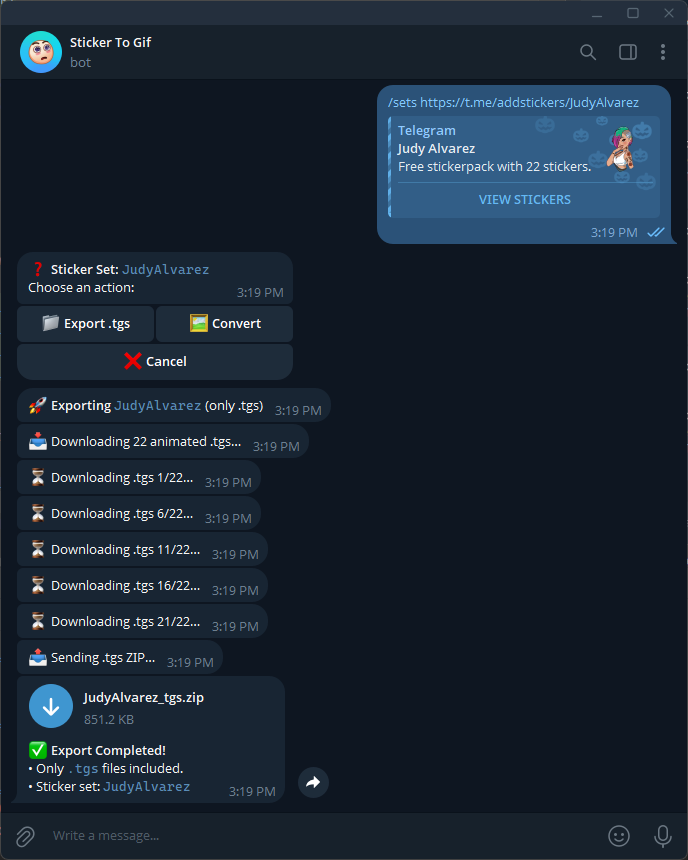

<p align="center">
    

</p>
<p align="center">
    
    <a href="readme_cn.md"></a>
    <a href="//julym.com/"></a>
    
    <a href="//github.com/SwaggyMacro/TgStoGifBot"></a>
</p>

## 🤖 Telegram Sticker Bot

Feature:
- Convert Telegram sticker(`tgs`) to GIF, PNG, APNG, and WEBP.
- Convert Telegram sticker sets to GIF, PNG, APNG, and WEBP.
- Download `.tgs` files(including sticker sets).

🤖 Demo Bot: [@sticker_to_gif_01_bot](https://t.me/sticker_to_gif_01_bot)  
Sticker set conversion has been `disabled` on this bot to minimize resource usage and prevent abuse. Only `single sticker` can be converted to GIF, PNG, APNG, or WEBP. However, downloading the full .tgs files of sticker sets is `still allowed`.

### 📝 System Requirements
---
Install run-time dependencies. Make sure the path to them present in PATH variable:

- **[gifski](https://gif.ski)** if you want to convert to GIF
- **[ffmpeg](https://ffmpeg.org)** if you want to convert to APNG
- **[img2webp](https://developers.google.com/speed/webp/docs/img2webp)** if you want to convert to WEBP

gifski is the only dependency required to convert to GIF, `gif only` in this repo, you may skip the rest if you don't
want to convert to APNG or WEBP.

- gifski
    - Ubuntu: Install gifski using the following command in three different ways:
      ```bash
      brew install gifski
      ```
      ```bash
      sudo snap install gifski
      ```
      ```bash
      cargo install gifski
      ```
    - Windows: Download the installer from the [gifski website](https://gif.ski/).
    - You may need to install [GTk3](https://github.com/tschoonj/GTK-for-Windows-Runtime-Environment-Installer/releases)
      runtime for lottie to work properly in windows(`reboot required`).

### 🖥️ How to use
---

#### 0. You may need permission to execute, read, write the script

```bash
chmod +777 ./TgStoGif -R
```

#### 1. Create a bot and Request the API from Telegram
- Create a bot using [BotFather](https://t.me/BotFather).
    - Copy the bot token and save it for later.
    - here's a [guide](https://core.telegram.org/bots#6-botfather) on how to create a bot.
  
#### 2. Install the required dependencies

- Install the required dependencies using the following command:

```bash
pip install -r requirements.txt
```
#### 3. Configure the cofing.json file
- copy the `config.json.example` file to `config.json` and fill in the required fields.

```json
{
  "bot_name": "Bot name",
  "bot_token": "from @BotFather",
  "bot_username": "@BotUsername",
  "allow_sticker_sets": true, // "True" if you want to allow the bot to convert the whole sticker set, "False" if you don't want to allow the bot to convert the whole sticker set.
  "convert_workers": 5,
  "download_workers": 5,
  "proxy": {
    "status": true, //true if you want to use a proxy, "False" if you don't want to use a proxy, and fill in the proxy details below, `without this note`.
    "type": "http",
    "host": "127.0.0.1",
    "port": 10803,
    "username": "",
    "password": ""
  }
}
```
#### 4. Run the script

- Run the script using the following command:
```bash
python main.py
```

#### 5. Talk to the bot
- Send a sticker to the bot, and it will convert it to a gif and send it back to you.
- Send a sticker set link to the bot, and it will convert all the stickers in the set to gif and zip it then send it back to you.

For example, you can use the following sticker set link to test the bot:
```
https://t.me/addstickers/GumLoveIs
```

### 🖼️ScreenShot
---





https://github.com/user-attachments/assets/a8cf5c0a-37bd-42f5-ba48-fa24fdbc2e18

### 🔗 Related Repositories
---
- [lottie-converter](https://github.com/ed-asriyan/lottie-converter) - Convert Lottie animations to GIF, APNG, and WebP.
- [lottie](https://gitlab.com/mattbas/python-lottie) - Render After Effects animations natively on Web, Android and iOS,
  and React Native.
- [pyrogram](https://github.com/pyrogram/pyrogram) - Telegram MTProto API Client Library and Framework in Pure Python
  for Users and Bots.
- [gifski](https://github.com/ImageOptim/gifski) - GIF encoder
- [ffmpeg](https://github.com/FFmpeg/FFmpeg) - A complete, cross-platform solution to record, convert and stream audio
  and video.
