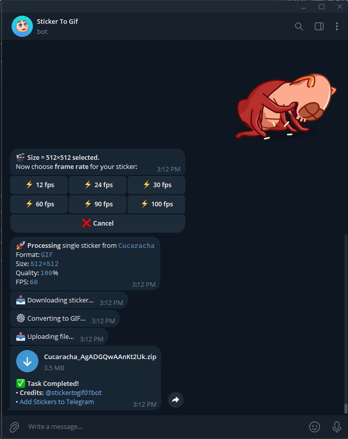

<p align="center">
    
</p>
<p align="center">
    
    <a href="readme.md"></a>
    <a href="//julym.com/"></a>
    
    <a href="//github.com/SwaggyMacro/TgStoGifBot"></a>
</p>

## 🤖 Telegram Sticker Bot

功能:
- 将电报的单个动画表情转换为GIF、PNG、APNG和WEBP格式的图片
- 将电报的动画表情包转换为GIF、PNG、APNG和WEBP格式的图片
- 导出`.tgs`文件（支持整个动画表情包的导出）

🤖 Demo Bot: [@sticker_to_gif_01_bot](https://t.me/sticker_to_gif_01_bot)  
为了减少`资源消耗`并防止`滥用`，`已禁用`该机器人上的动画表情包（Sticker set）转换功能。现在只允许将单个动画表情转换为 GIF、PNG、APNG 或 WEBP 格式。不过，仍然允许`下载整个`动画表情包的 `.tgs` 文件。

### 📝 系统需求
---
安装运行时依赖。确保它们的路径在PATH变量中：

- **[gifski](https://gif.ski)** 如果你想转换为GIF
- **[ffmpeg](https://ffmpeg.org)** 如果你想转换为APNG
- **[img2webp](https://developers.google.com/speed/webp/docs/img2webp)** 如果你想转换为WEBP

gifski是转换为GIF所唯一需要的依赖，此仓库中只需`仅限gif`，如果你不想转换为APNG或WEBP，你可以忽略其他的。

- gifski
    - Ubuntu: 使用下列命令通过三种不同方式安装gifski：
      ```bash
      brew install gifski
      ```
      ```bash
      sudo snap install gifski
      ```
      ```bash
      cargo install gifski
      ```
    - Windows: 从[gifski官网](https://gif.ski/)下载安装程序。
    - 你可能需要安装[GTk3](https://github.com/tschoonj/GTK-for-Windows-Runtime-Environment-Installer/releases)
      运行时以确保lottie在windows下正常工作（需要重新启动）。

### 🖥️ 如何使用
---

#### 0. 你可能需要`执行、读、写`脚本的权限

```bash
chmod +777 ./TgStoGif -R
```

#### 1. 创建一个机器人并从Telegram请求API
- 通过[BotFather](https://t.me/BotFather)创建一个机器人。
    - 复制机器人令牌并保存以备后用。
    - 这里有一个如何创建机器人的[指南](https://core.telegram.org/bots#6-botfather)。

#### 2. 安装所需的依赖

- 使用以下命令安装所需的依赖：

```bash
pip install -r requirements.txt
```
#### 3. 配置config.json文件
- 将`config.json.example`文件复制为`config.json`并填写所需字段。
```json
{
  "bot_name": "Bot name",
  "bot_token": "你的机器人令牌",
  "bot_username": "@BotUsername",
  "allow_sticker_sets": true, // "True" 如果你想允许机器人转换整个贴纸包， "False" 如果你不想允许机器人转换整个贴纸包。
  "convert_workers": 5,
  "download_workers": 5,
  "proxy": {
    "status": true, // "True" 如果你想使用代理， "False" 如果你不想使用代理，并填写下面的代理详情，记得删掉这条注释。
    "type": "http",
    "host": "127.0.0.1",
    "port": 10803,
    "username": "",
    "password": ""
  }
}
```
#### 4. 运行脚本

- 使用以下命令运行脚本:
```bash
python main.py
```

#### 5. 与机器人对话
- 发送表情给机器人，它会把它转换成gif然后发回给你。
- 发送一个表情包链接给机器人，它会把该表情包中的所有表情转换成gif，压缩后发送回给你。

示例，你可以使用以下表情包链接来测试机器人：
```
https://t.me/addstickers/GumLoveIs
```

### 🖼️屏幕截图
---



https://github.com/user-attachments/assets/a8cf5c0a-37bd-42f5-ba48-fa24fdbc2e18


### 🔗 相关仓库
---
- [lottie-converter](https://github.com/ed-asriyan/lottie-converter) - 将Lottie动画转换成GIF，APNG，和WebP格式。
- [lottie](https://gitlab.com/mattbas/python-lottie) - 在Web、Android和iOS上以及React Native上原生渲染After Effects动画。
- [pyrogram](https://github.com/pyrogram/pyrogram) - 纯Python编写的Telegram MTProto API客户端库和框架，适用于用户和机器人。
- [gifski](https://github.com/ImageOptim/gifski) - GIF编码器。
- [ffmpeg](https://github.com/FFmpeg/FFmpeg) - 一个完整的跨平台解决方案，用于录制、转换和流式传输音频和视频。
